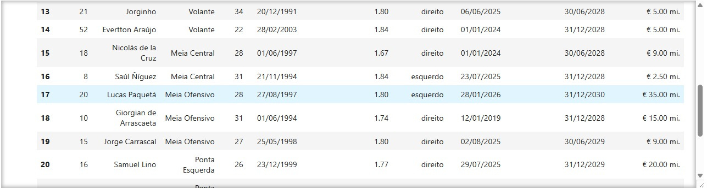

# 📊 Extração e Tratamento de Dados – Transfermarkt (Flamengo 2025)

## 📌 Sobre o Projeto

Este projeto realiza a extração, limpeza e transformação de dados do elenco do Flamengo (temporada 2025) a partir do site Transfermarkt.

Os dados são obtidos via web scraping utilizando Python, processados com BeautifulSoup e estruturados em um DataFrame com Pandas, seguindo a lógica de um pipeline ETL (Extract → Transform → Load).

O dataset final fica organizado e pronto para análise exploratória ou integração com ferramentas de Business Intelligence (como Power BI).

---

## 🎯 Objetivo Técnico

- Extrair dados diretamente do HTML da página  
- Estruturar informações em formato tabular  
- Separar campos combinados  
- Realizar tratamento e conversão de dados  
- Padronizar nomes de colunas  
- Gerar dataset pronto para análise  

---

## 🚀 Tecnologias Utilizadas

- Python 3.13.2
- Requests
- BeautifulSoup (lxml parser)
- Pandas
- Regex (re)

---

## 🔎 Pipeline do Projeto

1. Requisição HTTP com headers personalizados  
2. Parsing do HTML com BeautifulSoup  
3. Extração da tabela principal do elenco  
4. Separação de campos combinados  
5. Limpeza e conversão de dados  
6. Padronização de nomenclatura  
7. Estruturação final em DataFrame  

---

## 🧹 Limpeza e Tratamento dos Dados

Durante a extração, algumas colunas vieram com dados combinados ou em formato textual:

### 🔹 Coluna "Jogadores"
- Original: Nome + Posição no mesmo bloco HTML  
- Tratamento:
  - Extração do Nome
  - Criação da coluna Posição
  - Ajuste da coluna original para conter apenas o nome

### 🔹 Coluna "Nasc./Idade"
- Original: `DD/MM/AAAA (idade)`
- Tratamento:
  - Extração da idade (valor entre parênteses)
  - Criação da coluna Idade
  - Ajuste da coluna original para manter apenas a data de nascimento

### 🔹 Coluna "Altura"
- Original: `1,93m`
- Tratamento:
  - Remoção do sufixo `m`
  - Conversão para valor numérico (1.93)

### 🔹 Padronização de Colunas

```python 
df = df.rename(columns={
    "#": "Número",
    "Nasc./Idade": "Data de Nasc.",
    "Nac.": "Nacionalidade",
    "Pé": "Pé Dominante",
    "No time desde": "No Time Desde",
    "Anterior": "Clube Anterior",
    "Contrato": "Contrato Até",
    "Valor de mercado": "Valor Mercado(Euro)"
})
``` 
---

## 📁 Estrutura Final dos Dados

| Coluna | Descrição |
|--------|-----------|
| Número | Número da camisa |
| Nome | Nome do jogador |
| Posição | Posição em campo |
| Idade | Idade atual |
| Data de Nasc. | Data de nascimento |
| Nacionalidade | País |
| Altura | Altura em metros |
| Pé Dominante | Pé preferido |
| No Time Desde | Data de chegada |
| Clube Anterior | Último clube |
| Contrato Até | Data de término do contrato |
| Valor Mercado(Euro) | Valor estimado de mercado |

---

## 📷 Exemplo de Saída do DataFrame



## 📦 Como executar o projeto

1. Clone o repositório:

```bash
git clone https://github.com/SEUUSUARIO/extracao-e-tratamento-dados-transfermarkt-flamengo.git
```

2. Acesse a pasta:

```bash
cd extracao-e-tratamento-dados-transfermarkt-flamengo
```

3. Instale as dependências:

```bash
pip install -r requirements.txt
```

4. Execute o script:

```bash
python src/main.py
```

## 📈 Possíveis Expansões Futuras
- Conversão do valor de mercado para tipo numérico
- Exportação automática para CSV/Excel
- Criação de dashboard no Power BI
- Automatização para múltiplos clubes
- Aplicação de Análise Exploratória de Dados (EDA)

## 👨‍💻 Autor
Pedro Vasconcelos de Pinho
Estudante de Ciência da Computação
Foco em Ciência de Dados

